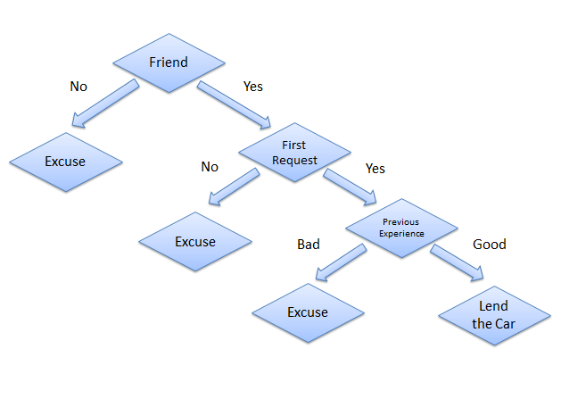
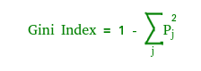
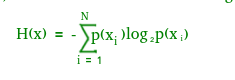

# Decision tree
## Definition
* Graphical representation of all possible solution to a decision.
* Decision are based on some conditions.
* Decision mede can be easily explained.
* Decision tree is one of the most powerful and popular algorithm.
* Decision tree algorithm falls under the category of supervised learning algorithms.
* Though, It works for both continuous as well as categorical

    



````
Root Node : Start
Branches : Edges
Nodes : Decision Points
Leaves : Terminal Nodes
````


* **Root Node:** It represents entire population or sample and this further gets divided into two or more homogeneous sets.
* **Splitting:** It is a process of dividing a node into two or more sub-nodes.
* **Decision Node:** When a sub-node splits into further sub-nodes, then it is called decision node.
* **Leaf/ Terminal Node:** Nodes do not split is called Leaf or Terminal node.
* **Pruning:** When we remove sub-nodes of a decision node, this process is called pruning. You can say opposite process of splitting.
* **Branch / Sub-Tree:** A sub section of entire tree is called branch or sub-tree.
* **Parent and Child Node:** A node, which is divided into sub-nodes is called parent node of sub-nodes where as sub-nodes are the child of parent node.


### Advantages:

* Decision trees are easy to explain. it results in a set of rules
* Simple to understand, interpret, and visualize.
* It follows the same approach as humans generally follow while ma king decisions.
* Data preparation is not much required.
* Interpretation of a complex decision tree model can be simplifie d by its visualizations.Even a naive person can understand logic.
* The number of hyper parameters to be tuned is almost null.
* It can handle numerical as well as categorical data.
* Non linear parameters has no impact on performance.

### Disadvantages:

* there is a high probability of overfitting in decision tree, whe n the algorithms capture\nnoise in the data.
* generally, it gives low prediction accuracy for a dataset as com pared to other machine learning algorithms.
* information gain in a decision tree with categorical variables g ives a biased response for attributes with greater no. of categories.
* calculations can become complex when there are many class labels
* high variance. the model can get unstable due to small variation s in data.
* low biased tree. highly complicated decision trees tends to have a low bias which makes it difficult for the model to work with new data.

### Assumptions we make while using decision tree :

* At the beginning, we consider the whole training set as the root.
* Attributes are assumed to be categorical for information gain and for gini index, attributes are assumed to be continuous.
* On the basis of attribute values records are distributed recursively.
* We use statistical methods for ordering attributes as root or internal node.

### Gini index ( Fast coz single calculation)

* Gini index is a metric to measure how often a randomly chosen element would be incorrectly identified. 
* It means an attribute with lower gini index should be preferred. 
* Sklearn supports “ Gini ” criteria for gini index and by default, it takes “ Gini ”.



### Entropy (Slow coz multiple calculation required)

* Entropy is the measure of uncertainty of a random variable, it characterizes the impurity of an arbitrary collection ofexamples. the higher the entropy the more the informationcontent.


