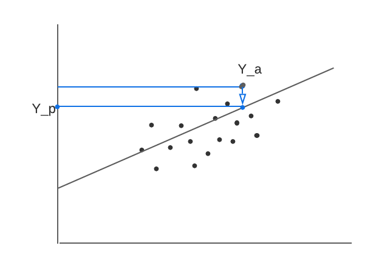
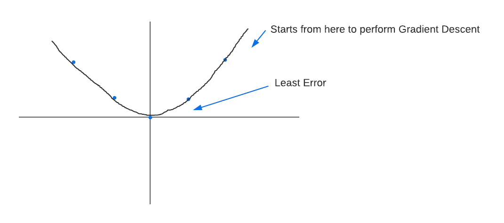

# Linear Regression

## Definition
* **Linear Regression tends to establish a relationship between a dependent variable(Y) and one or more independent variable(X) by finding the best fit of the straight line.**
* The equation for the Linear model is **Y = mX+c**, where m is the slope and c is the intercept
* Linear Regression When we want to predict real continuous values as an output

* There is no straight line that runs through all the data points. 
* So, the objective here is to fit the best fit of a straight line that will try to minimize the error between the expected and actual value.

#### Problem:
* [**Multi-colinearity**](https://github.com/iAmKankan/MachineLearning_With_Python/edit/master/Linear%20Regrassion/correlation.md) is the occurrence of high intercorrelations among two or more independent variables in a multiple regression model. 
* Multicollinearity can lead to skewed or misleading results.
* In general, multicollinearity can lead to wider confidence intervals that produce less reliable probabilities in terms of the effect of independent variables in a model.
* If we have variables with Multicollinearity need to be removed.
*  Generally 'dataframe.corr()' shows the colinearity between variables. Where **-0.4 to 0.4** is accectable range for colinearity between variables.
*  For 

* **Linear Regression is of 2 types**
    * Simple Linear Regression 
    * Multivariate Linear Regression
    
     
* **Simple Linear Regression** 

* It contains only one input variable. Only one straight line.

    * Y = Dependent Variable
    * a = Y intercept
    * b = slope of the line
    * X = Independent variable
* Y intercept(a): is the value of the Dependent variable(y) when the value of the indipendent variable is zero(0). This is the point at which the line cuts the y-axis.

* Slope(b): is the change in the Dependent Variable(y) for a unit increase in the indipendent variable. It is the tangent of  the angle made by the line with the x-axis.

* **Multi Regrtession Models**

* Here we need to find out all the  coefficients.
* It means the beta is creating some kind of relationship or slope it is creating with respect to the output variable
* Findout the relationshio between beta and the output variables..

### Error/Loss/Cost:
* The aim is to minimize the error which is the distance from the bestfit line to each observation.
* The Deviation or the Error is like-
* Deviation is called Residual.

* **The mail goal is to reduce the error**.

* -ve Y actuals also there thats why we take the squre of the whole residuals

* **Residual Sum Of Squres(RSS) = Ordinary least squares(OLS) = Error function = Loss Function.**

* Now we have to take the minimum of all errors. That's will give us the beest fit line.

* Inorder to fing out the minimum of a function we need to use first order derivation and second order derivation to find out the minima and maxima.

* **Best-fit-line we need to find out when we findout the 'a' and the 'b' that's the line which is the min error.**
---

* **This function is parabola.or Convex shaped curve**

* if we replace the above function with this 
    * for X= -1,-2,0,1,2 result will be 1,4,0,1,4 if we ploted over a chart it will be like- 

* Inorder to findout the minimum error we use gradient descent

https://www.mladdict.com/linear-regression-simulator
* The learning rate is represented by alpha 

## Batch Gradient Descent

Gradient descent is an iterative optimization algorithm for finding the minimum of a cost function described above. To find a local minimum of a function using gradient descent, one takes steps proportional to the negative of the gradient (or approximate gradient) of the function at the current point.

Picture below illustrates the steps we take going down of the hill to find local minimum.

The direction of the step is defined by derivative of the cost function in current point.

Once we decided what direction we need to go we need to decide what the size of the step we need to take.

We need to simultaneously update  for _j = 0, 1, ..., n_

 - the learning rate, the constant that defines the size of the gradient descent step

 - _jth_ feature value of the _ith_ training example

 - input (features) of _ith_ training example

_yi_ - output of _ith_ training example

_m_ - number of training examples

_n_ - number of features

> When we use term "batch" for gradient descent it means that each step of gradient descent uses **all** the training examples (as you might see from the formula above).

## Feature Scaling

To make linear regression and gradient descent algorithm work correctly we need to make sure that features are on a similar scale.

For example "apartment size" feature (e.g. 120 m2) is much bigger than the "number of rooms" feature (e.g. 2).

In order to scale the features we need to do **mean normalization**

 - _jth_ feature value of the _ith_ training example

 - average value of _jth_ feature in training set

 - the range (_max - min_) of _jth_ feature in training set.

## Polynomial Regression

Polynomial regression is a form of regression analysis in which the relationship between the independent variable _x_ and the dependent variable _y_ is modelled as an _nth_ degree polynomial in _x_.

Although polynomial regression fits a nonlinear model to the data, as a statistical estimation problem it is linear, in the sense that the hypothesis function is linear in the unknown parameters that are estimated from the data. For this reason, polynomial regression is considered to be a special case of multiple linear regression.

Example of a cubic polynomial regression, which is a type of linear regression.

You may form polynomial regression by adding new polynomial features.

For example if the price of the apartment is in non-linear dependency of its size then you might add several new size-related features. 

## Normal Equation

There is a closed-form solution to linear regression exists and it looks like the following:

Using this formula does not require any feature scaling, and you will get an exact solution in one calculation: there is no “loop until convergence” like in gradient descent.

## Regularization

### Overfitting Problem

If we have too many features, the learned hypothesis may fit the **training** set very well:

**But** it may fail to generalize to **new** examples (let's say predict prices on new example of detecting if new messages are spam).

### Solution to Overfitting

Here are couple of options that may be addressed:

- Reduce the number of features
    - Manually select which features to keep
    - Model selection algorithm
- Regularization
    - Keep all the features, but reduce magnitude/values of model parameters (thetas).
    - Works well when we have a lot of features, each of which contributes a bit to predicting _y_.

Regularization works by adding regularization parameter to the **cost function**:

> Note that you should not regularize the parameter .

 - regularization parameter

In this case the **gradient descent** formula will look like the following:

## References

- [Machine Learning on Coursera](https://www.coursera.org/learn/machine-learning)
- [Linear Regression on Wikipedia](https://en.wikipedia.org/wiki/Linear_regression)
- [Gradient Descent on Wikipedia](https://en.wikipedia.org/wiki/Gradient_descent)
- [Gradient Descent by Suryansh S.](https://hackernoon.com/gradient-descent-aynk-7cbe95a778da)
- [Gradient Descent by Niklas Donges](https://towardsdatascience.com/gradient-descent-in-a-nutshell-eaf8c18212f0)
- [Overfitting on GeeksForGeeks](https://www.geeksforgeeks.org/underfitting-and-overfitting-in-machine-learning/)
